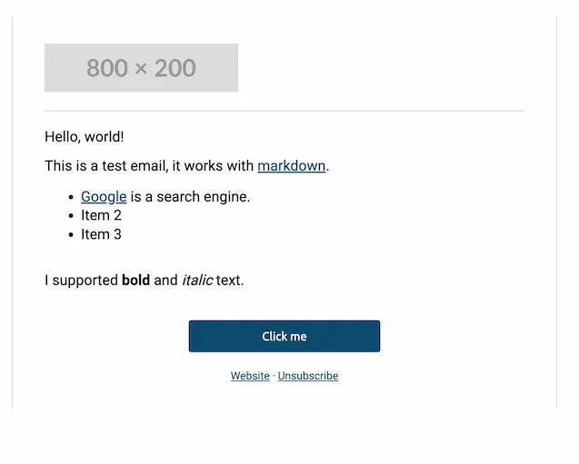

# EasyEmails

EasyEmails is a go package the makes it easy to build emails using a simple and clean API. It is built
using the standard library and has no dependencies.

## Who is this for?

People who need to send transactional emails and want to do so in a simple and clean way. This package
has minimal customization options and provides an opinionated way to build emails. If you need more
customization, you should either fork this package or use a different one.

## Supported Markup

Within any text, you can use the following markdown:

- **Bold**: `**bold**`
- _Italic_: `*italic*`
- [Links](http://example.com): `[Links](http://example.com)`

## Examples

```go
bldr := easyemails.NewBuilder().Add(
    easyemails.WithParagraph(
        easyemails.WithText("Hello, world!"),
        easyemails.WithLineBreak(),
        easyemails.WithText("This is a test email, it works with [markdown](http://example.com)."),
        easyemails.WithList(
            "[Google](http://google.com) is a search engine.",
            "Item 2",
            "Item 3",
        ),
        easyemails.WithLineBreak(),
        easyemails.WithText("I supported **bold** and *italic* text."),
        easyemails.WithLineBreak(),
    ),
    easyemails.WithButton("Click me", "http://example.com"),
    easyemails.WithParagraph(
        easyemails.WithText("[Website](http://example.com/website) · [Unsubscribe](http://example.com/unsubscribe)").Centered(),
    ).FontSize(12),
)

rendered := bldr.Render()
```

### Output

]
