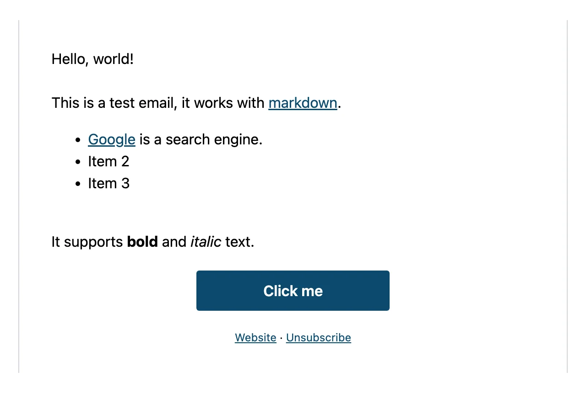

# EasyEmails

EasyEmails is a go package that makes it easy to build emails using a simple and clean API. It is built
using the standard library and has no dependencies.

## Who is this for?

People who need to send transactional emails and want to do so in a simple and clean way. This package
has minimal customization options and provides an opinionated way to build emails. If you need more
customization, you should either fork this package or use a different one.

## Supported Markup

Within any text, you can use the following markdown:

- **Bold**: `**bold**`
- _Italic_: `*italic*`
- [Links](http://example.com): `[Links](http://example.com)`

Text is HTML-escaped before the markup is applied, so raw HTML shows as text. Markup in user input
still converts, so a user can add bold text or links to their own content.

## Examples

```go
bldr := easyemails.NewBuilder().Add(
    easyemails.WithParagraph(
        easyemails.WithText("Hello, world!"),
        easyemails.WithLineBreak(),
        easyemails.WithText("This is a test email, it works with [markdown](http://example.com)."),
        easyemails.WithList(
            "[Google](http://google.com) is a search engine.",
            "Item 2",
            "Item 3",
        ),
        easyemails.WithLineBreak(),
        easyemails.WithText("It supports **bold** and *italic* text."),
    ),
    easyemails.WithButton("Click me", "http://example.com").Centered(),
    easyemails.WithParagraph(
        easyemails.WithText("[Website](http://example.com/website) · [Unsubscribe](http://example.com/unsubscribe)"),
    ).Centered().FontSize(12),
)

html := bldr.Render()
text := bldr.RenderPlain()
```

### Output



## Logo and Colors

`NewBuilder` reads the `Default` variables, so you can set them once at program start when all of your
emails look the same:

```go
easyemails.DefaultLogo = "https://example.com/logo.png"
easyemails.DefaultPrimaryColor = "#3c3e58"
easyemails.DefaultBorderColor = "#f0f0f0"
```

To change a single email, use the methods on the builder:

```go
bldr := easyemails.NewBuilder().
    Logo("https://example.com/other-logo.png").
    PrimaryColor("#000000").
    PrimaryTextColor("#ffffff")
```
